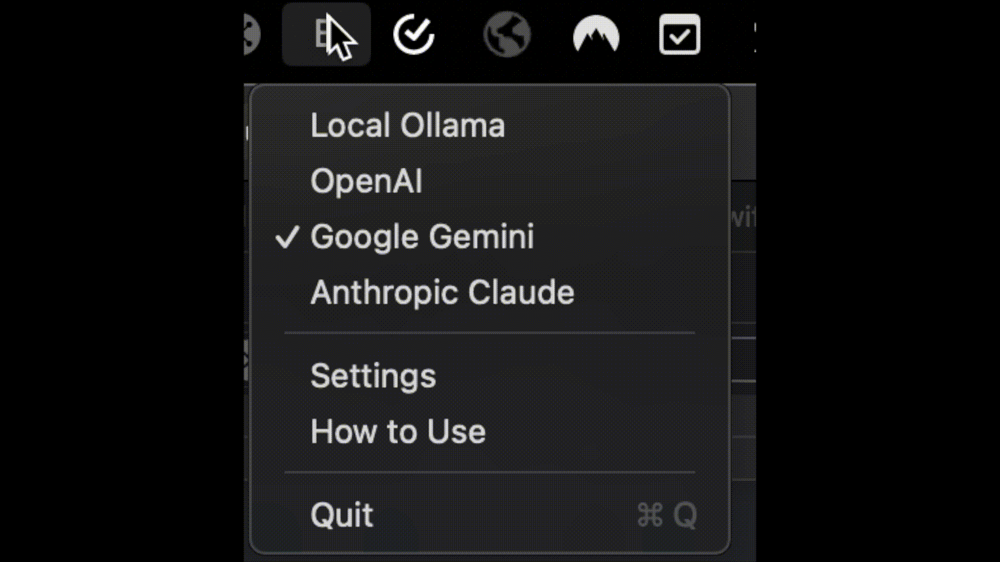

# BHelper 🪄

  

**Enhance your writing with the power of AI, right from your Mac's menu bar!**

BHelper is a macOS menu bar app that lets you effortlessly rewrite selected text using state-of-the-art AI models from leading providers. 

**Note:** This app is currently unsigned due to the $99 Apple Developer Program fee, which I'm in the process of obtaining while actively developing multiple applications.

## ✨ Features

* **Effortless Rewriting:**  Select text in any application, use a simple keyboard shortcut, and BHelper will intelligently rewrite it using your chosen AI model.
* **Multiple AI Providers:** Choose from a variety of AI services:
    - **Ollama:** Run powerful language models locally on your Mac (free).
    - **OpenAI:** Access GPT-4 and GPT-4 Turbo (paid).
    - **Google:** Utilize the advanced capabilities of Gemini (free).
    - **Anthropic:** Experience the helpfulness of Claude models (free $5 credit available). 
* **Model Selection:** Select your preferred model from each provider, tailored to your specific needs:
    - **Ollama:** llama3, mistral 
    - **OpenAI:** gpt-4, gpt-4-turbo
    - **Google:** gemini-1.5-pro 
    - **Anthropic:** claude-2, claude-instant-1, sonnet-3.5, opus
* **Customizable Pre-prompts:** Craft prompts to guide the AI's rewriting style and ensure it meets your requirements.
* **Global Hotkeys:** Trigger text transformations and prompt input with convenient keyboard shortcuts.
* **Seamless Integration:** Works with any application where you can select text. 

## 🚀 Getting Started

### 1. Download:

   - Download the latest release of BHelper from the [Releases](https://github.com/yourusername/BHelper/releases) page.
   - Look for the file ending in `.zip`. This is a compressed file that contains the BHelper application.

### 2. Installation:

   - **Find the downloaded `BHelper.zip` file.** It's usually in your Downloads folder.
   - **Double-click the `BHelper.zip` file.** This will extract the contents and create a new folder named "BHelper."
   - **Open the "BHelper" folder.** Inside, you'll find the `BHelper.app` application file.
   - **Drag the `BHelper.app` file into your Applications folder.** This will install BHelper on your Mac.

### 3. First Time Run:

   - **Because BHelper is not downloaded from the official Mac App Store, your Mac might warn you that it's from an unidentified developer.** This is normal for apps distributed outside the App Store. 
   - **To allow BHelper to run:**
      - **Right-click (or Control-click) on the `BHelper.app` file.**
      - **Select "Open" from the menu.** 
      - **You'll see a warning dialog asking if you're sure you want to open it. Click "Open."**
   - **BHelper will now launch, and you'll see its icon in your menu bar (the row of icons at the top right corner of your screen).**

### 4. Grant Accessibility Permissions:

   - **BHelper needs special permissions to work properly because it needs to be able to read and modify the text you select in other applications.**
   - **When you launch BHelper for the first time, you'll see a prompt asking you to grant accessibility permissions.**
   - **To grant permissions:**
     - **Click the "Open System Preferences" button in the prompt.**
     - **This will open the "Security & Privacy" settings on your Mac.**
     - **Click the "Privacy" tab.**
     - **In the list on the left, select "Accessibility."**
     - **You might see a locked padlock icon at the bottom left corner of the window. If it's locked, click it and enter your Mac's password to unlock the settings.**
     - **Find "BHelper" in the list of apps.**
     - **Check the box next to "BHelper" to allow it to control your computer.**

### 5. API Keys (if required):

   - Some AI providers (OpenAI, Anthropic) require API keys for you to use their services.
   - **If you want to use these providers, you'll need to get API keys from their websites and enter them into BHelper.**
   - **Here's how:**
     - **Click the BHelper icon in your menu bar.**
     - **Select "Settings" from the menu.**
     - **Enter your API keys in the appropriate fields.**
     - **Click "Save" to store your settings.**

## 🗝️ API Key Information

### OpenAI

- Get your OpenAI API key here: [https://beta.openai.com/account/api-keys](https://beta.openai.com/account/api-keys)

### Anthropic

- Sign up for an Anthropic account (you'll get $5 in free credits) and get your API key here: [https://console.anthropic.com/](https://console.anthropic.com/) 

## 🆓 Free AI Options

- **Ollama:** Allows you to run powerful language models locally on your Mac, making it a completely free option!
- **Google Gemini:** Google's Gemini AI is currently available for free.

## ⌨️ Hotkeys

- **Transform with Pre-prompt:**  <kbd>Command</kbd> + <kbd>Control</kbd> + <kbd>Option</kbd> + <kbd>U</kbd> 
- **Use Selection as Prompt:** <kbd>Command</kbd> + <kbd>Control</kbd> + <kbd>Option</kbd> + <kbd>I</kbd> 

## 🤝 Contributing

Contributions are welcome! Feel free to open issues or submit pull requests.

## 🙏 Acknowledgements

Special thanks to the developers of the following libraries:

- [SwiftAnthropic](https://github.com/jamesrochabrun/SwiftAnthropic)
- [OpenAISwift](https://github.com/adamrushy/OpenAISwift.git)
- [GoogleGenerativeAI](https://github.com/google/generative-ai-swift)
- [Down](https://github.com/johnxnguyen/Down.git)

Let me know if you have any other questions. 